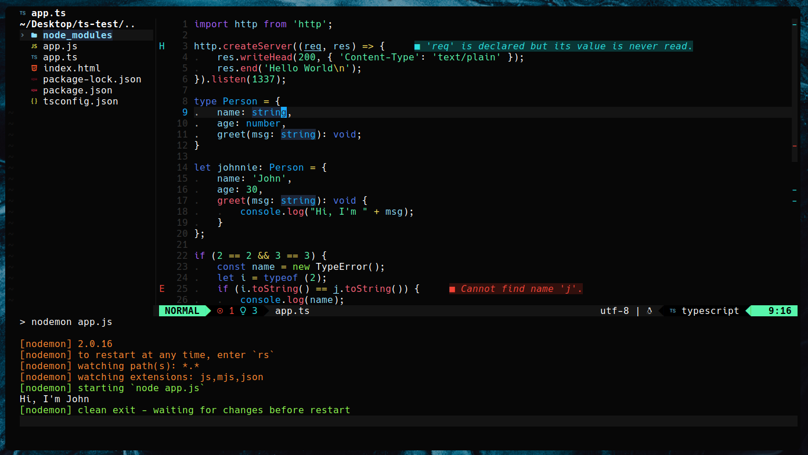

# mgz.nvim

A really dark NeoVim theme.

> ***TODO*** - Add new screenshot.

<details>
<summary> Old version of the theme. </summary>

 
</details>

### Installation

Install it through your favourite package manager as `'stankovictab/mgz.nvim'`.

To enable the colorscheme, you can use the following somewhere in your config.
```lua
vim.cmd('colorscheme mgz')
```

### Configuration

The MGZ theme allows for these options to be changed :
- `mgz_disable_background` - Disables the setting of background color, so that NeoVim can use your terminal emulator's background color. Default is false. 
- `mgz_italic` - Whether to render text in italics or not. Default is true. 

```lua
-- Example config in lua
vim.g.mgz_disable_background = true
vim.g.mgz_italic = false
```

### Notices

I usually make changes to this theme depending on the plugins I'm using in my NeoVim config, 
so because that is my priority, I wouldn't theme some of the more obscure plugins that I don't use.\
However, if you want to you can always open an issue or a pull request and I'll try to add support for it.

If you're using an LSP plugin, it might interfere with the colorscheme by applying different syntax highlighting that overrides the theme. You can see [this](https://www.reddit.com/r/neovim/comments/109vgtl/how_to_disable_highlight_from_lsp/) for more info.

---

The structure of the theme is based off of [nord.nvim](https://github.com/shaunsingh/nord.nvim), so there might still be some old code and styling in there.

The MGZ theme is also available for [VSCode](https://github.com/stankovictab/mgz-dark-theme).
